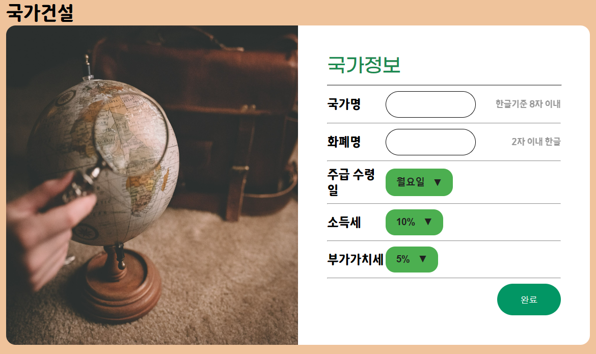
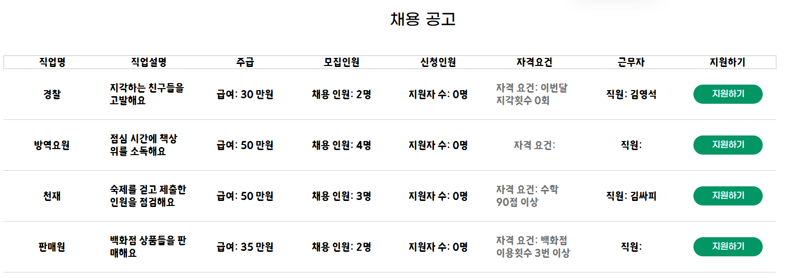
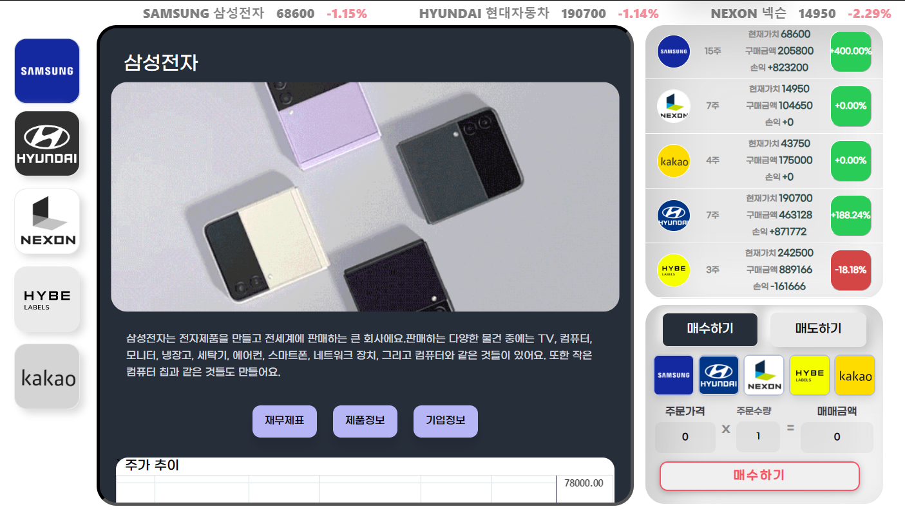
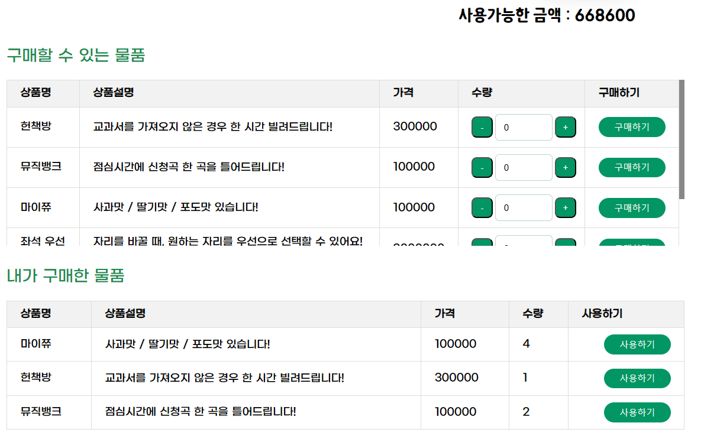
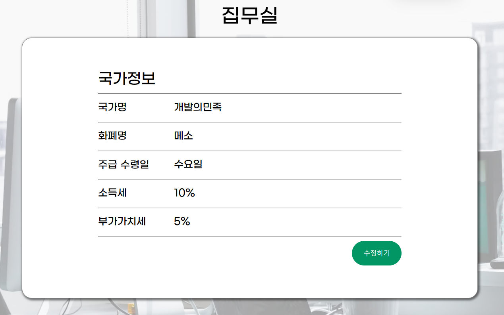
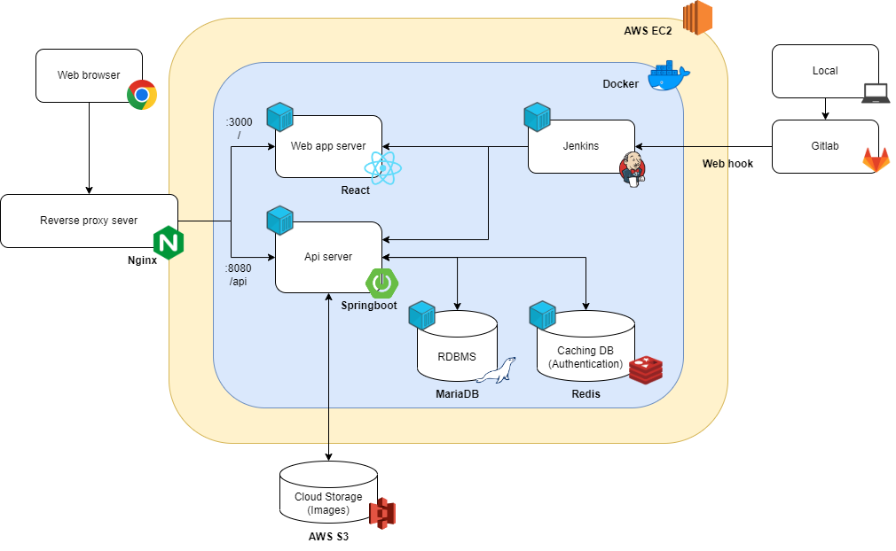
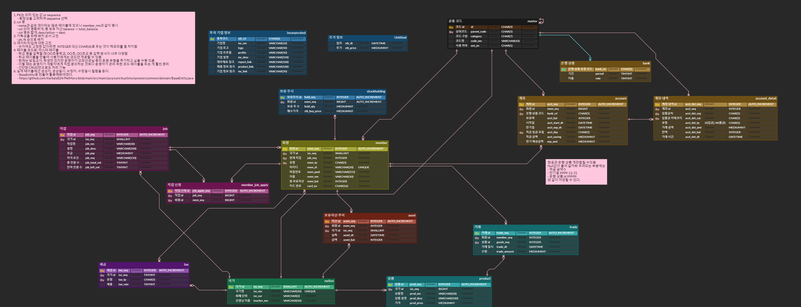

# Minination

## 목차

1. [서비스 소개](#-1-서비스-소개)
2. [진행 기간](#-2-진행-기간)
3. [주요 기능](#-3-주요-기능)
4. [구성원](#-4-구성원)
5. [시스템 아키텍쳐](#-5-시스템-아키텍쳐)
6. [기술 스택](#-6-기술-스택)
7. [ER Diagram](#-7-er-diagram)
8. [협업툴](#-8-협업툴)
9. [API 명세서](#-9-API-명세서)
10. [코드 컨벤션](#-10-코드-컨벤션)
11. [커밋 컨벤션](#-11-커밋-컨벤션)
12. [Git Flow 브랜치 전략](#-12-git-flow-브랜치-전략)

## 💸 1. 서비스 소개

교실 속 우리들의 작은 국가, Minination!

Minination은 초등학생을 위한 체험형 경제교육 플랫폼 서비스입니다.
아이들은 이곳에서 노동, 투자, 예금, 소비, 납세 등의 행위를 통해 즐겁게 경제 관념을 학습할 수 있습니다.

UCC 주소 : https://youtu.be/qVyjf8vWGSA

## 💸 2. 진행 기간

2023.08.21 ~ 2023.10.06 (7주)

## 💸 3. 주요 기능

### 1. 국가 생성, 국적 취득

- 선생님이 국가명, 세율, 헌법 등 시뮬레이션 환경을 세팅합니다.
- 학생들은 Minination에 회원가입한 후, 국가 검색을 통해 자신의 반 선생님이 세팅해둔 국가의 국적을 취득할 수 있습니다.

### 2. 홈화면

- 본인이 속한 국가의 메인 화면입니다.
- 국가명, 국기, 본인의 프로필, 국가에서 가장 많은 돈을 보유한 학생의 순위, 국가의 경제발전 그래프, 헌법, 구성원 등 다양한 정보를 확인할 수 있습니다.

### 3. 직업 생성, 구직 활동

- 선생님은 각 학급에 필요한 다양한 역할을 직업 생성 기능을 통해 정해줍니다.
  - (ex) 방역요원 : 점심 시간에 친구들의 책상 위를 소독해요. / 주급 : 50만원. / 모집인원 : 2명
- 여기서 주급으로 받게 되는 화폐는 가상의 돈이며 선생님이 국가 생성 시 설정해둔 주급 수령일에 학생의 계좌로 학급 화폐가 자동 이체 됩니다.
- 학생은 채용공고 게시판에서 직업 설명, 주급, 자격요건 등을 보고 원하는 직업을 지원할 수 있습니다.
- 선생님은 지원한 학생들 중 해당 직업에 적합한 인원에게 직업 지원을 승인해주고, 그렇지 않은 인원에겐 거절할 수 있습니다.

### 4. 주식 투자

- 초등학생에게 익숙한 기업 중 5개를 선정하여 실제 기업의 주가를 받아옵니다.
  - 삼성전자, 현대자동차, 넥슨게임즈, 하이브, 카카오
- 학생들은 증권거래소 게시판에서 각 회사의 광고, 기업 설명, 기업정보 등을 확인할 수 있습니다. 또한 회사 주가의 최근 1달 동안의 주가 추이를 그래프로 확인할 수 있습니다.
- 학급 화폐를 통해 실제 주가와 동일한 가격에 원하는 회사의 주식을 매수, 매도할 수 있습니다.

### 5. 은행 업무

- 학생들은 은행 게시판에서 본인의 현금/주식/저축 자산과 1달 동안 본인의 자산 변동 현황을 확인할 수 있습니다.
- 자산 변동 현황의 세부 항목은 '입출금 내역조회'에서 입출금처/금액/잔액/날짜를 확인할 수 있습니다.
- '금융상품 가입'에서 예금과 적금 상품에 가입할 수 있습니다. 만기일이 되면 각 상품의 이자율에 맞는 금액을 더해서 돌려받습니다.
- '가입한 상품조회'에서 본인이 가입한 예금, 적금 상품의 가입일과 만기일, 원금과 만기 예상금액을 확인할 수 있습니다. 또한 학생이 원한다면 해당 상품을 해지하고 즉시 원금을 돌려받을 수 있습니다.

### 6. 소비

- 백화점 게시판에서 선생님은 학생들이 구입할 수 있는 상품을 상품명/상품설명/가격과 함께 등록할 수 있습니다.
  - (ex) 상품명 : 헌책방, 상품설명 : 교과서를 가져오지 않은 경우 한 시간 빌려드립니다!, 가격 : 300000
- 학생들은 선생님이 등록한 상품을 구매할 수 있는 물품 목록에서 확인하고, 원하는 상품을 원하는 수량만큼 구매할 수 있습니다.
- '내가 구매한 물품'에서 본인이 구입한 물품의 설명, 수량을 확인하고 사용을 원하는 경우 사용하기 버튼을 통해 해당 상품을 소비할 수 있습니다.

### 7. 집무실

- 집무실 게시판은 선생님만 상단 메뉴를 통해 접근할 수 있는 게시판입니다.
- 국가명, 화폐명, 주급 수령일, 소득세, 부가가치세를 조회하고 설정할 수 있습니다.

## 💸 4. 구성원

## 💸 5. 시스템 아키텍쳐

## 💸 6. 기술 스택

### 1. Front

- React로 사용자와의 상호작용이 많은 웹 페이지를 효율적으로 구현하고 관리하였습니다.
- Recoil은 react에 특화된 상태관리 도구이면서 러닝 커브가 낮으므로 사용하였습니다. 이를 이용해 API 응답 데이터를 캐싱함으로써 서버 통신 비용을 줄였습니다.
- npm을 패키지 관리에 사용하였습니다. yarn과 성능이 비슷하지만 보다 커뮤니티가 더 크고 참고 자료가 많으므로 선택하였습니다.

### 2. Back

- Springboot로 웹 어플리케이션 서버를 구축하였습니다.
- Spring Rest Docs는 테스트 코드 작성을 먼저 해야하므로 짧은 개발 기간에 사용하기에 부적합하다고 판단하였습니다. 따라서 api 문서 자동화 도구로 swagger를 선택하였습니다
- Spring Data Jpa을 통해 서버와 데이터베이스 매핑을 객체지향적으로 설계하였고 BaseEntity를 통해 db의 생성시간, 생성자, 수정시간, 수정자를 기록하였습니다.
- Query Dsl은 컴파일 시에 오류를 잡아 효율적인 개발이 가능하게 해주어서 도입하였습니다.

### 3. DB

- 금융 업무를 처리하는 작업이므로 데이터의 안정성이 중요하다고 판단하였습니다. 따라서 데이터 구조가 동적으로 변하는 NoSQL보다는 데이터의 일관성과 무결성을 보장하는 RDBMS를 선택하였습니다. 그 중 MariaDB는 오픈소스로 무료로 사용 가능하고, MySQL과 완벽히 호환되며 커뮤니티가 활발하므로 선택하였습니다.
- Redis는 가벼운 데이터를 빈번하게 저장/삭제하는데 유리하고 데이터의 유효 시간을 설정할 수 있으므로 사용자 인증 시 토큰을 저장하는 DB로 사용하였습니다.
- AWS S3는 국기, 기업 프로필 로고 이미지를 저장하기 위해서 사용하였습니다.

### 4. Infra

- Docker를 통해 react app, 서버, 데이터베이스 등을 컨테이너화하였습니다. 도커 방화벽을 설정하여 도커 컨테이너에 직접적인 접근을 제한하였습니다.
- Jenkins는 CI/CD 파이프라인을 구축하기 위해 사용하였습니다. GitLab에 Webhook을 설정하여 코드에 변경사항이 있을 때마다 서버에 반영할 수 있도록 하였습니다.

## 💸 7. ER Diagram

 

## 💸 8. API 명세서

https://pyh-dotcom.notion.site/API-ee059890d8e94b3eac93dee50af9810d?pvs=4

## 💸 9. 협업툴

- Gitlab
- Jira
- Notion
- Mattermost

## 💸 10. 코드 컨벤션

### 1. Front

- space와 tab을 섞어서 사용하지 않는다.(공백 문자 2개)
- 한 줄에 하나의 문장만 허용하며, 문장 종료 시 반드시 세미콜론(;)을 사용한다.
- 변수는 카멜 케이스를 사용한다.
- 상수는 영문 대문자 스네이크 표기법(Snake case)을 사용한다.
- 이벤트 핸들러는 'on'으로 시작한다.
- 이미지 파일명은 케밥 케이스를 사용한다. (sample-image.png)
- 축약어는 사용하지 않는다. (img -> image) 
- 값이 변하지 않는 변수는 `const`를, 값이 변하는 변수는 `let`을 사용하여 선언한다. `var`는 절대로 사용하지 않도록 한다.
- 외부 모듈과 내부 모듈을 구분하여 사용한다.
- 자기 참조 할당은 하지 않는다.
- 'var' 사용 시 반드시 함수 스코프의 시작 지점에서 선언한다.
- 배열과 객체는 반드시 '리터럴'로 선언한다.
- 배열 복사 시 for 순환문을 사용하지 않는다.
- 객체의 프로퍼티가 1개인 경우에만 한 줄 정의를 허용하며, 2개 이상의 경우에는 개행을 강제한다.
객체의 메서드 표현 시 '축약 메소드 표기'를 사용한다.
- 함수 표현식 대신 화살표함수를 사용한다.
- 화살표 함수의 파라미터가 하나라면 괄호를 생략한다.
- 함수의 본체가 하나의 표현식이면 중괄호를 생략하고 암시적 반환을 사용할 수 있다. 그 외에는 'return'문을 명시해야한다.
- 오브젝트의 프로퍼티에 접근할 때 Destructuring을 이용한다.

### 2. Back

- 변수명은 camelCase를 사용하고 명사로 명명합니다.
- 함수명은 camelCase를 사용하고 동사로 명명합니다.
- 클래스 명은 UpperCase를 사용하고 명사로 명명합니다.
  - (ex) Member
- 클래스 선언, 메서드 선언, 조건/반복문의 시작 중괄호`{`는 선언부와 같은 줄에 사용합니다.
- 함수의 행 길이는 25줄 이하로 작성하는 것을 지향합니다.
- 배열 선언시 대괄호`[]` 는 타입 옆에 지정합니다. 예: String[] args (O), String args[] (X)
- 약어는 camelCase를 사용합니다. 예: urlApi (O), URL API(X)
- DTO 클래스는 요청은 xxxRequest, 응답은 xxxResponse로 명명합니다.
- LocalDateTime 타입의 변수는 xxxAt으로 네이밍합니다.

## 💸 11. 커밋 컨벤션

- feat: 새로운 기능 구현
- fix: 오류 수정
- docs: readme.md, json 파일 등 수정, 라이브러리 설치 (문서 관련)
- refactor: 코드 리팩토링
- style: 코드에 변화가 없는 수정 (세미콜론 등)
- chore: 빌드 부분 혹은 패키지 매니저 수정 사항
- rename: 파일 혹은 폴더명 수정, 옮기기
- remove: 파일 삭제
- ci: 배포 관련 작업

## 💸 12. Git Flow 브랜치 전략

- master
- fe
  - fe/dev (배포)
  - -
  - fe/member/login
  - fe/bank/checkAccount
- be
  - be/dev (배포)
  - be/member
    - be/member/login/S09A508-33
  - be/bank
    - be/bank/checkAccount
